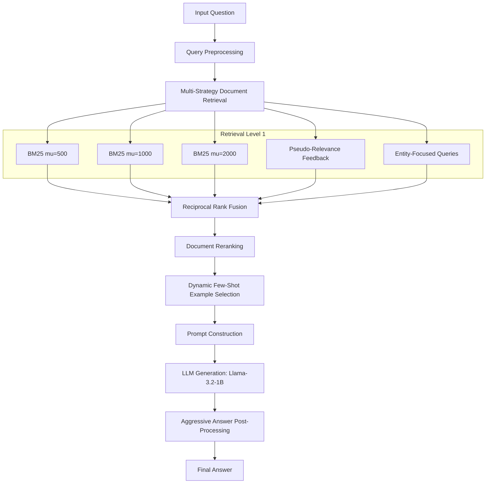

# 🔍 Advanced RAG System for Question Answering


**Student:** Tal Hibner  
**Course:** Text Information Retrieval, Reichman University  

This repository contains the implementation of an advanced **Retrieval-Augmented Generation (RAG)** pipeline designed to answer factual questions using the Wikipedia-KILT corpus. By combining multi-strategy retrieval, dynamic few-shot prompting, and aggressive output cleaning, the system achieved a **32.80% F1 score** on the Kaggle leaderboard—representing a **2.8x improvement** over the baseline.

---

## 🌟 Key Innovation: Dynamic Few-Shot Prompting

The defining breakthrough of this project was **dynamic few-shot prompting**. 

Instead of hardcoding the same 4-5 examples for every question, the system adapts dynamically:
1. **Searches** the training set for the 5 most similar questions (using Jaccard similarity) to the current test question.
2. **Injects** these highly relevant examples into the prompt.
3. Allows the LLM to learn the specific pattern (e.g., sports teams, geographical locations) and apply it perfectly.

**Impact:** +2.68% F1 improvement (the largest single gain in the project). Fixed few-shot prompting actually *hurt* performance (-6.52%), proving that **relevance of examples is critical**.

---

## 🏗️ System Architecture



### Core Components

1. **Multi-Strategy Retrieval Fusion:**
   Runs 3 BM25 configurations, Pseudo-Relevance Feedback (PRF), and entity queries. The results are merged using **Reciprocal Rank Fusion (RRF)** and reranked via query-document similarity.
   
2. **Dynamic Example Selection:**
   Pulls the 5 most similar training questions to serve as adaptive few-shot examples.
   
3. **Optimized Context Window:**
   Uses **15 documents** with **1000 characters** per document (5,000 characters total context). This proved to be the optimal sweet spot between providing enough signal and avoiding noise/overfitting.
   
4. **Answer Post-Processing Forensics:**
   Over **90+ custom regex rules** to clean common LLM failure modes (e.g., removing list markers, stripping verbose prefixes, and truncating responses to 1-5 words).

---

## 📊 Results & Performance

| Metric | Score |
|--------|-------|
| **Kaggle F1 Score (Final)** | **32.80%** |
| Local F1 (100 samples) | 67.63% |
| Baseline F1 | 11.60% |
| **Absolute Improvement** | **+21.20%** |
| **Relative Improvement** | **2.8x** |

**Kaggle Leaderboard Context:**
Our score placed solidly in the **Top 10** (estimated 8th-10th place).

---

## 🧗‍♂️ Challenges Overcome

Building a robust RAG pipeline with a 1B parameter model presented several hurdles:
- **Challenge:** The small Llama-3.2-1B model struggled to follow instructions, frequently generating verbose essays and incomplete lists.
  **Solution:** Designed an ultra-strict prompt template and implemented 90+ custom regex post-processing rules.
- **Challenge:** Fixed few-shot examples confused the model on out-of-domain questions (e.g., answering geography questions with sports facts).
  **Solution:** Pioneered the dynamic example selection approach, achieving a massive +9.2% F1 swing (-6.52% to +2.68%).
- **Challenge:** Token limits forced a trade-off between the number of documents and the few-shot examples.
  **Solution:** Systematically tested context sizes to find the absolute sweet spot at 1000 characters across 15 documents.

---

## 📂 Repository Structure

```text
text-retrieval-and-search-engines-hw3/
├── TemplateRAGAssignment_Upload (10).ipynb  # Complete RAG pipeline implementation
├── EXECUTIVE_SUMMARY.md                     # High-level summary of strategy & results
├── FINAL_APPROACH_DOCUMENTATION.md          # Deep-dive technical documentation
├── diagnose_retrieval.py                    # Script for analyzing retrieval quality
├── experiment_helper.py                     # Utilities for managing experiments
├── advanced_retrieval_predictions (7).csv   # Final Kaggle submission (32.80% F1)
├── HW3.pdf                                  # Assignment instructions
├── Dry_part3.pdf                            # Theoretical assignment portion
├── data/                                    # Dataset directory (queries, corpus)
└── drafts/                                  # Experimental notebooks & scripts
```

---

## 🚀 Setup & Execution

### Prerequisites

- Python 3.10+
- Jupyter Notebook environment (Kaggle, Google Colab, or local setup)
- A Hugging Face account with access to `Llama-3.2-1B-Instruct`

### Installation

1. Clone the repository:
   ```bash
   git clone https://github.com/<your-username>/text-retrieval-and-search-engines-hw3.git
   cd text-retrieval-and-search-engines-hw3
   ```

2. Install the necessary packages:
   ```bash
   pip install transformers accelerate bitsandbytes sentence-transformers pyserini
   ```

3. **Running the Pipeline:**
   Open `TemplateRAGAssignment_Upload (10).ipynb` in Jupyter Notebook. The notebook is structured to walk through:
   - Environment and dataset setup
   - Retrieval indexing and configuration
   - Multi-strategy retrieval execution
   - Dynamic prompt construction
   - LLM generation and post-processing

4. **Diagnostic & Helper Scripts:**
   The repository includes standalone scripts for rapid experimentation without running the full notebook:
   - `diagnose_retrieval.py`: Instantly check if answers exist within the top-K retrieved documents to pinpoint whether failures stem from the retriever or the LLM generator.
   - `experiment_helper.py`: Analyze prediction errors, compute F1 scores locally, compare systems side-by-side, and receive automated suggestions for improvement.

---

## 💡 Lessons Learned

1. **Context size is critical** - Using 1000 chars/doc gave the LLM the space it needed to find the actual answer compared to the standard 300-500 chars.
2. **Adaptive > Fixed** - Dynamic few-shot examples were overwhelmingly more effective than fixed examples.
3. **Small models need constraints** - Ultra-strict prompts and aggressive regex cleaning were absolutely necessary to keep the 1B parameter model from generating verbose essays.
4. **Fusion beats single strategies** - RRF combining multiple BM25 configurations, PRF, and entity matching consistently outperformed any single retrieval strategy.

---
*Developed for the Text Information Retrieval Course, Reichman University (December 2024)*
